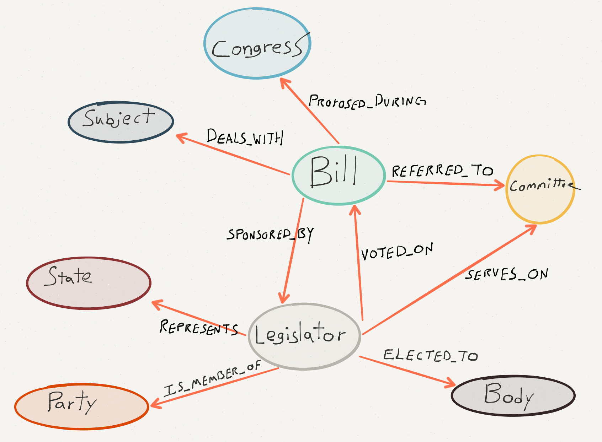
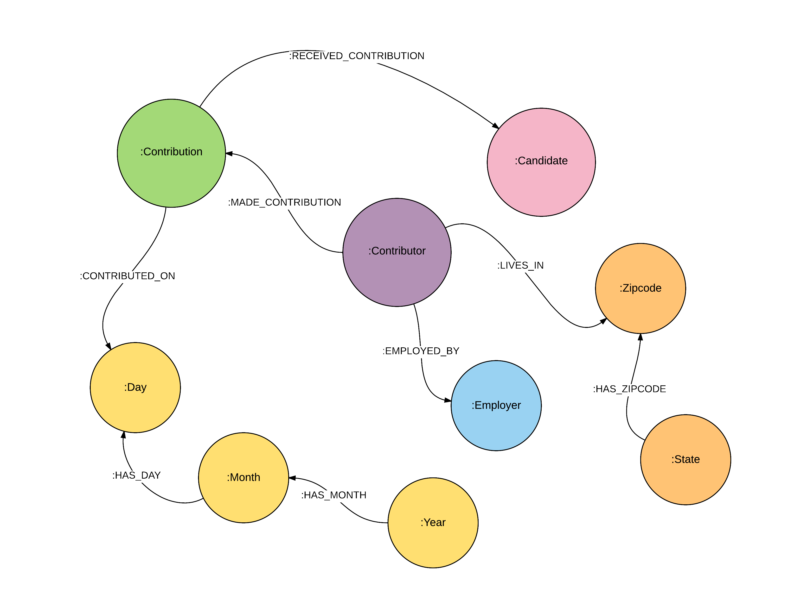
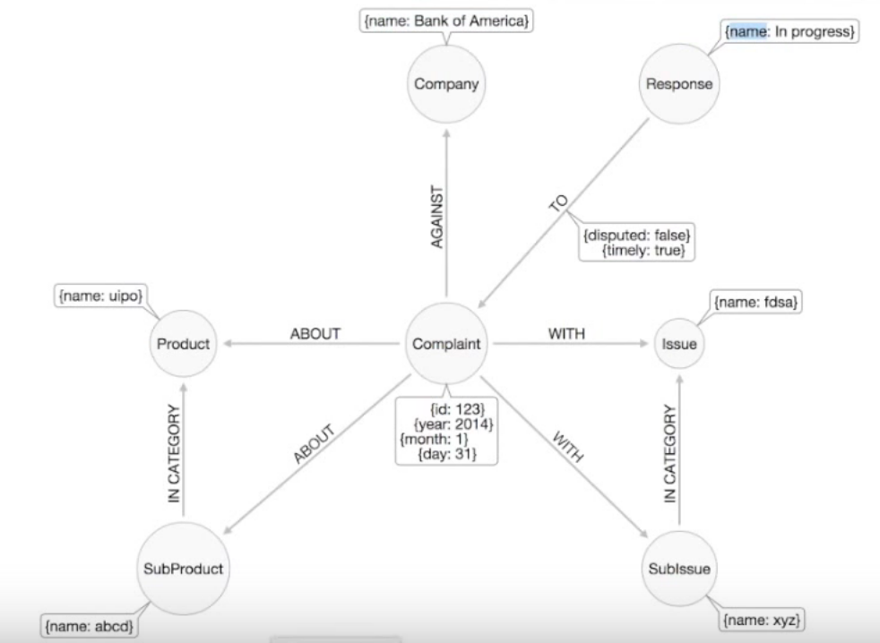
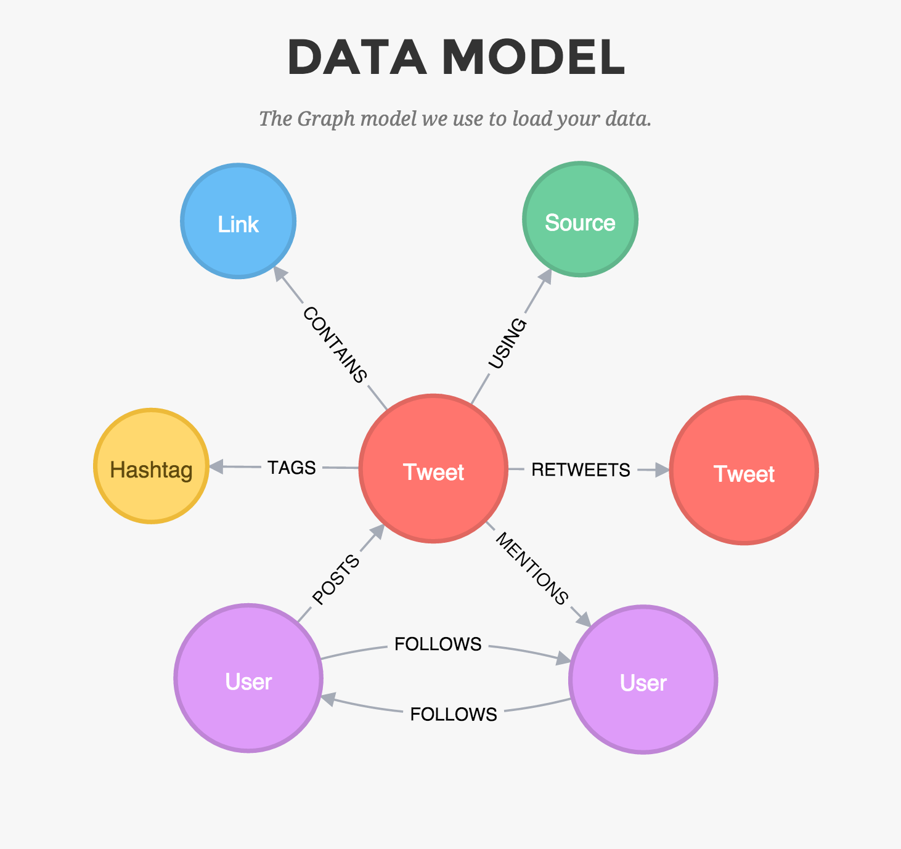

# GraphHack 2015

## Datasets

### Legis-graph - US Congress in a graph

* [Github repository](https://github.com/legis-graph/legis-graph)
* [Quickstart import from your web browser](http://johnymontana.github.io/LazyWebCypher/?file=https://raw.githubusercontent.com/legis-graph/legis-graph/master/quickstart/114/legis_graph_import_114.cypher)

### FEC filings

* [Github gist](https://gist.github.com/johnymontana/fd3de5219e9a15e67fb7)
* [Quickstart import from your web browser](http://www.lyonwj.com/LazyWebCypher?file=https://gist.githubusercontent.com/johnymontana/fd3de5219e9a15e67fb7/raw/7f25d1f2b37a1811720b1d3339335a60b7c6e35f/FEC-2015.cql)

### Consumer complaints

[Github repository](https://github.com/nicolewhite/neo4j-complaints)

### Your own Twitter network

[Sign in with Twitter to import your network to Neo4j](http://network.graphdemos.com/)

### Other sites

We don't have Neo4j import scripts or graph exports for these, but we think they might be interesting to explore:

* [US Government's open data](http://www.data.gov/)
* [NASA's Data Portal](https://data.nasa.gov/)
* [US City Data](http://us-city.census.okfn.org/)
* [US Spending data](https://www.usaspending.gov/Pages/default.aspx)
* [Deep and interesting datasets for computational journalism](http://cjlab.stanford.edu/2015/09/30/lab-launch-and-data-sets/)

## Resources

[Neo4j Get Started](http://neo4j.com/developer/get-started/)

### Install Neo4j

* [Download Neo4j](http://neo4j.com/download/)
* [Neo4j with Docker](http://neo4j.com/developer/docker/)

### Graph Story

* [Graph Story Free Trial](https://console.graphstory.com/join)
* [One click dataset import to GraphStory](https://console.graphstory.com/sample-data)

### Cypher 

* [Cypher Refcard](http://neo4j.com/docs/stable/cypher-refcard/)
* [Intro to Cypher](http://neo4j.com/developer/cypher-query-language/)
* [Cypher docs](http://neo4j.com/docs/stable/cypher-query-lang.html)

#### LOAD CSV

* [Load CSVs With Success](http://jexp.de/blog/2014/10/load-cvs-with-success/)
* [LOAD CSV Quickly And Successfully](http://jexp.de/blog/2014/06/load-csv-into-neo4j-quickly-and-successfully/)
* [Neo4j Cypher Avoiding the Eager](http://www.markhneedham.com/blog/2014/10/23/neo4j-cypher-avoiding-the-eager/)
* [Neo4j CSV Import Web Tool](http://neo4j-csv-import.herokuapp.com)

### GraphGist

* [Neo4j GraphGist Project](http://gist.neo4j.org/)
* [GraphGist Portal](http://graphgist.neo4j.com/#!/gists)
* [How do I create a GraphGist?](http://graphgist.neo4j.com/#!/gists/about)

### Neo4j Visualization

* [Viz overview](http://neo4j.com/developer/guide-data-visualization/)
* [Alchemy.js](https://github.com/GraphAlchemist/Alchemy)
* [Vis.js](http://visjs.org/network_examples.html)

### More

* [Awesome Neo4j](https://github.com/GraphGeeks/awesome-neo4j) - curated list of Neo4j resources
